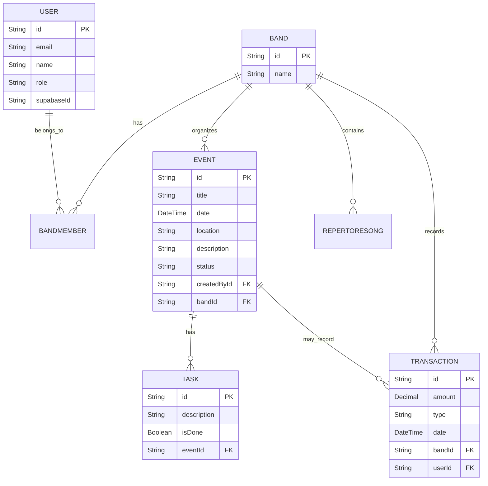

# ERD (Entidade-Relacionamento) — My Roadie

Modelo atual (resumido a partir de `prisma/schema.prisma`):

Entities principais:

- User
  - id: uuid (PK)
  - email: string (unique)
  - name: string?
  - role: enum {MUSICIAN, ROADIE, ADMIN}
  - supabaseId: string (unique)
  - createdAt, updatedAt

- Band
  - id: uuid (PK)
  - name
  - createdAt, updatedAt

- BandMember
  - id: uuid (PK)
  - userId -> User.id
  - bandId -> Band.id
  - role (string?)
  - joinedAt
  - unique[userId, bandId]

- Event
  - id: uuid (PK)
  - title, date, location, description, status
  - bandId -> Band.id
  - createdById -> User.id
  - createdAt, updatedAt

- Task
  - id: uuid (PK)
  - description, isDone
  - eventId -> Event.id (onDelete: Cascade)
  - createdAt

- RepertoireSong
  - id: uuid (PK)
  - title, artist?, key?, position, notes
  - bandId -> Band.id

- Transaction
  - id: uuid (PK)
  - description, amount (Decimal), type (INCOME|EXPENSE), date
  - bandId -> Band.id
  - eventId? -> Event.id
  - userId -> User.id
  - createdAt

Mermaid diagram (visual):

Notas:
- BandMember possui índice único `[userId, bandId]`.
- Ao alterar o schema, execute migrations e `npx prisma generate`. 