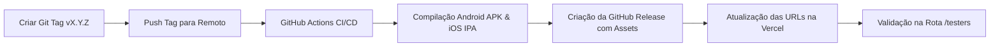

# Runbook Operacional — Geração e Distribuição de Releases Mobile (MVP)

Este runbook documenta os procedimentos operacionais para geração, compilação, publicação e configuração dos executáveis de release mobile (`my-roadie-release.apk` para Android e `my-roadie-release.ipa` para iOS) distribuídos aos testadores do My Roadie através da rota `/testers`.

---

## 1. Visão Geral do Fluxo de Release



O canal primário oficial de hospedagem e distribuição é o **GitHub Releases**, aproveitando a CDN global pública e permanente da plataforma.

---

## 2. Pré-requisitos e Segredos

Antes de iniciar um processo de release, verifique se os seguintes itens estão configurados:

1. **GitHub Secrets do Repositório**:
   - `BACKEND_URL`: URL da API do backend em produção (ex.: `https://api.myroadie.com` ou URL no Render) injetada em tempo de compilação nos binários mobile.
   - Permissão `contents: write` habilitada no GitHub Actions para permitir que o workflow crie releases e faça upload de assets (`softprops/action-gh-release@v2`).
2. **Acesso à Vercel**:
   - Permissão no projeto `frontend-web` na Vercel para atualizar Environment Variables quando necessário.

---

## 3. Procedimento de Publicação de Release

### Opção A: Publicação Automatizada via Git Tag (Recomendado)

1. **Garantir que a branch `main` está atualizada e testada**:
   ```bash
   git checkout main
   git pull origin main
   ```

2. **Criar uma tag semântica anotada**:
   > Use o prefixo `v` seguido pelo versionamento semântico (ex.: `v1.0.0`, `v1.0.1-mvp`, `v1.1.0`).
   ```bash
   git tag -a v1.0.0 -m "Release MVP v1.0.0"
   ```

3. **Subir a tag para o repositório remoto**:
   ```bash
   git push origin v1.0.0
   ```

4. **Acompanhar a execução no GitHub Actions**:
   - Acesse a aba **Actions** no repositório GitHub.
   - O workflow `CI / CD Pipeline` será acionado automaticamente pelo trigger de tag `v*`.
   - O pipeline executará os jobs de compilação mobile (`mobile-android-build` e `mobile-ios-build`) e, em seguida, o job `publish-github-release`.

5. **Verificar a Release publicada**:
   - Acesse a aba **Releases** no GitHub (`https://github.com/<owner>/<repo>/releases`).
   - Confirme a presença dos dois anexos públicos:
     - `my-roadie-release.apk`
     - `my-roadie-release.ipa`

---

### Opção B: Publicação Manual via GitHub Actions (Workflow Dispatch)

Caso precise gerar e publicar uma release a partir de uma branch específica sem criar uma tag imediatamente:

1. Acesse o GitHub > **Actions** > selecione o workflow **CI / CD Pipeline**.
2. Clique em **Run workflow**.
3. Preencha os parâmetros:
   - **Branch**: selecione `main` (ou a branch desejada).
   - **Backend API URL**: informe a URL do backend de produção (se omitido, o pipeline utilizará `secrets.BACKEND_URL`).
   - **Publish GitHub Release**: marque a opção (ou defina como `true`).
4. Clique em **Run workflow** e aguarde a conclusão do job `publish-github-release`.

---

### Opção C: Compilação Local de Contingência (Fallback)

Se o GitHub Actions estiver indisponível ou houver necessidade de compilação local offline:

#### Compilar APK (Android):
```bash
cd mobile
flutter pub get
flutter build apk --release --dart-define=BACKEND_URL="https://sua-api.com"
# O binário é gerado em: build/app/outputs/flutter-apk/app-release.apk
# Renomeie para a nomenclatura padrão:
mv build/app/outputs/flutter-apk/app-release.apk build/app/outputs/flutter-apk/my-roadie-release.apk
```

#### Compilar IPA (iOS - sem assinatura / no-codesign):
```bash
cd mobile
flutter pub get
flutter build ios --release --no-codesign --dart-define=BACKEND_URL="https://sua-api.com"
# Empacotar em formato IPA:
mkdir -p build/ios/iphoneos/Payload
cp -r build/ios/iphoneos/Runner.app build/ios/iphoneos/Payload/
cd build/ios/iphoneos
zip -r my-roadie-release.ipa Payload
cd ../../..
```

Faça o upload manual dos arquivos na interface web de Releases do GitHub.

---

## 4. Configuração das Variáveis no Frontend Web (Vercel e Local)

Para que os botões na rota `/testers` apontem para os binários recém-publicados:

### A. URLs Canônicas do GitHub Releases

- **Download Direto da Última Versão (`latest` - Recomendado para manter links fixos)**:
  - APK: `https://github.com/LucasDavid80/my-roadie-platform/releases/latest/download/my-roadie-release.apk`
  - IPA: `https://github.com/LucasDavid80/my-roadie-platform/releases/latest/download/my-roadie-release.ipa`

- **Download por Tag Fixa (Imutável)**:
  - APK: `https://github.com/LucasDavid80/my-roadie-platform/releases/download/v1.0.0/my-roadie-release.apk`
  - IPA: `https://github.com/LucasDavid80/my-roadie-platform/releases/download/v1.0.0/my-roadie-release.ipa`

### B. Configuração no Painel da Vercel (Produção e Preview)

1. Acesse o dashboard do projeto `frontend-web` na Vercel.
2. Navegue até **Settings** > **Environment Variables**.
3. Adicione/atualize as variáveis:

| Variável | Valor Recomendado | Ambientes |
|---|---|---|
| `NEXT_PUBLIC_APK_DOWNLOAD_URL` | `https://github.com/LucasDavid80/my-roadie-platform/releases/latest/download/my-roadie-release.apk` | Production, Preview, Development |
| `NEXT_PUBLIC_IPA_DOWNLOAD_URL` | `https://github.com/LucasDavid80/my-roadie-platform/releases/latest/download/my-roadie-release.ipa` | Production, Preview, Development |
| `NEXT_PUBLIC_APP_VERSION` | `v1.0.0-mvp` (ou a versão corrente) | Production, Preview, Development |

4. **Redeploy**: No painel da Vercel, acione o **Redeploy** do último commit para que o Next.js compile com as novas variáveis estáticas `NEXT_PUBLIC_*`.

### C. Configuração no Ambiente Local (`.env.local`)

Em `frontend-web/.env.local`:
```env
NEXT_PUBLIC_APK_DOWNLOAD_URL=https://github.com/LucasDavid80/my-roadie-platform/releases/latest/download/my-roadie-release.apk
NEXT_PUBLIC_IPA_DOWNLOAD_URL=https://github.com/LucasDavid80/my-roadie-platform/releases/latest/download/my-roadie-release.ipa
NEXT_PUBLIC_APP_VERSION=v1.0.0-mvp
```

---

## 5. Checklist de Validação Pré-Distribuição

Antes de divulgar o link `/testers` para o grupo fechado de testadores:

- [ ] **Validação HTTP das URLs de Download**:
  Execute no terminal para verificar se os links retornam HTTP 200 ou 302 (redirecionamento do GitHub Releases):
  ```bash
  curl -I -L https://github.com/LucasDavid80/my-roadie-platform/releases/latest/download/my-roadie-release.apk
  curl -I -L https://github.com/LucasDavid80/my-roadie-platform/releases/latest/download/my-roadie-release.ipa
  ```
- [ ] **Acesso à Rota de Testadores**:
  Acesse `https://seu-dominio.vercel.app/testers` e confirme:
  - O badge de versão exibe a versão esperada (`NEXT_PUBLIC_APP_VERSION`).
  - Os botões "Baixar APK (Android)" e "Baixar IPA (iOS)" estão ativos e apontam diretamente para os links corretos.
  - Nenhum clique redireciona para página 404 (Not Found).
- [ ] **Instalação em Dispositivo Android Real**:
  - Faça o download do `.apk` pelo smartphone.
  - Habilite "Instalar de fontes desconhecidas" no navegador.
  - Verifique se a aplicação abre e se comunica com o backend (`BACKEND_URL`).
- [ ] **Instalação em Dispositivo iOS**:
  - Teste a instalação do `.ipa` através de ferramenta de sideload (ex.: Sideloadly ou AltStore) ou via conta de desenvolvedor corporativa.

---

## 6. Troubleshooting & FAQ

### 1. O clique no botão de download retorna 404
- **Causa**: A variável de ambiente não foi injetada no build do Next.js ou a release ainda não foi criada no GitHub com o nome exato do arquivo.
- **Solução**:
  1. Verifique se o asset na release chama-se exatamente `my-roadie-release.apk` ou `my-roadie-release.ipa`.
  2. Verifique se o repositório é **público** (se for privado, o GitHub Releases exige autenticação).
  3. Realize o **Redeploy** na Vercel após alterar as variáveis de ambiente.

### 2. O pipeline do GitHub Actions falhou no step `publish-release`
- **Causa**: Falta de permissão de escrita de conteúdo (`contents: write`) no token do GitHub Actions.
- **Solução**:
  1. Vá em **Settings** > **Actions** > **General** > **Workflow permissions**.
  2. Selecione **Read and write permissions**.
  3. Reexecute o job com falha.

### 3. A UI `/testers` exibe o badge "Em breve / Aguardando build"
- **Causa**: `NEXT_PUBLIC_APK_DOWNLOAD_URL` ou `NEXT_PUBLIC_IPA_DOWNLOAD_URL` não foram definidas ou contêm valores inválidos (comportamento de resiliência implementado na Spec 018).
- **Solução**: Configure as variáveis de ambiente na Vercel ou no `.env.local` e recompile a aplicação web.
