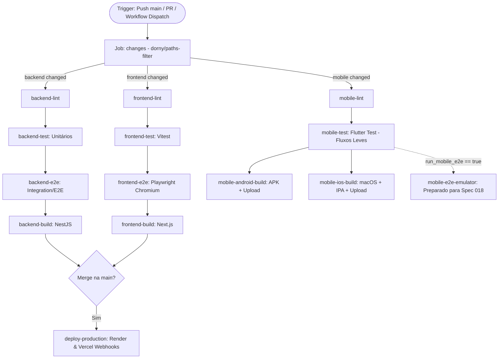

# Plan — 017: Pipeline CI/CD Unificado & Modernizado

## 1. Arquitetura do Pipeline CI/CD

O workflow será centralizado em `.github/workflows/ci.yml`, estruturado com paralelismo inteligente, detecção estrita de caminhos e estágios ordenados por dependência de sucesso:



## 2. Configuração de Gatilhos & Filtros de Paths

### Gatilho `workflow_dispatch`
Permite a execução manual na UI do GitHub com os seguintes inputs:
```yaml
workflow_dispatch:
  inputs:
    scope:
      description: 'Escopo de execução dos jobs'
      required: true
      default: 'auto'
      type: choice
      options:
        - auto
        - all
        - backend
        - frontend
        - mobile
    backend_url:
      description: 'URL do backend para injeção nos builds mobile'
      required: false
      default: 'https://my-roadie-backend.onrender.com'
      type: string
    run_mobile_e2e:
      description: 'Executar testes E2E com Emulador Mobile (Consome mais minutos de CI)'
      required: false
      default: false
      type: boolean
```

### Job de Detecção de Mudanças (`changes`)
Utiliza `dorny/paths-filter@v3` para inspecionar os arquivos afetados no commit/PR:
```yaml
changes:
  runs-on: ubuntu-latest
  outputs:
    backend: ${{ steps.filter.outputs.backend }}
    frontend: ${{ steps.filter.outputs.frontend }}
    mobile: ${{ steps.filter.outputs.mobile }}
  steps:
    - uses: actions/checkout@v4
    - uses: dorny/paths-filter@v3
      id: filter
      with:
        filters: |
          backend:
            - 'backend/**'
            - 'prisma/**'
            - '.github/workflows/ci.yml'
          frontend:
            - 'frontend-web/**'
            - '.github/workflows/ci.yml'
          mobile:
            - 'mobile/**'
            - '.github/workflows/ci.yml'
```

## 3. Integração de Testes E2E

### Backend E2E (`backend-e2e`)
- Executado após o sucesso de `backend-test`.
- Roda `npx prisma generate` e `npm run test:e2e`.
- Utiliza mock em memória de JWKS (`test/__mocks__/jwks-rsa.js`) e banco de dados configurado para testes.

### Frontend Web E2E & Testes Unitários (`frontend-test` e `frontend-e2e`)
- Executado após o sucesso de `frontend-lint`.
- Configuração do Vitest com `pool: 'threads'` em `frontend-web/vitest.config.ts` garantindo estabilidade e isolamento na execução dos testes unitários e de componentes.
- Instala o browser Chromium com dependências de SO: `npx playwright install --with-deps chromium`.
- Executa `npx playwright test`.

### Mobile E2E & Integração
- **Dia a dia (PRs/Pushes)**: Execução no job `mobile-test` através do `flutter test` (cobrindo testes unitários e testes de integração de widget/fluxo sem emulador, como `profile_flow_integration_test.dart`), mantendo o tempo de execução abaixo de 30 segundos.
- **Sob Demanda (Gancho Spec 018)**: Configuração do step/job `mobile-e2e-emulator` condicionado a `inputs.run_mobile_e2e == true`, pronto para receber os scripts da Spec 018 sem impactar a cota padrão.

## 4. Compilação Mobile & Publicação Padronizada de Artefatos

### Android (`mobile-android-build`)
- Runner: `ubuntu-latest`.
- Java 17 (`zulu`) + Android SDK + Flutter stable.
- Build: `flutter build apk --release --dart-define=BACKEND_URL=${{ inputs.backend_url || secrets.BACKEND_URL }}`.
- Upload: `actions/upload-artifact@v4` publicando `mobile/build/app/outputs/flutter-apk/app-release.apk` como `my-roadie-android-release-apk` com `retention-days: 7`.

### iOS (`mobile-ios-build`)
- Runner: `macos-latest`.
- Build: `flutter build ios --release --no-codesign --dart-define=BACKEND_URL=${{ inputs.backend_url || secrets.BACKEND_URL }}`.
- Empacotamento em `Payload/Runner.app` -> `my-roadie-release.ipa`.
- Upload: `actions/upload-artifact@v4` publicando `mobile/my-roadie-release.ipa` como `my-roadie-ios-release-ipa` com `retention-days: 7`.

## 5. Deploy Contínuo (`deploy-production`)

- Disparado exclusivamente quando `github.ref == 'refs/heads/main'` e `github.event_name == 'push'` (ou `workflow_dispatch` na main).
- Depende de `[backend-build, frontend-build]`.
- Executa requisições `POST` seguras aos webhooks do Render (`RENDER_DEPLOY_HOOK`) e Vercel (`VERCEL_DEPLOY_HOOK`).

## 6. Estratégia de Caching e Otimização

- **Node/npm**: `actions/setup-node@v4` com `cache: 'npm'` apontando para os respectivos `package-lock.json`.
- **Flutter**: `subosito/flutter-action@v2` com `cache: true`.
- **Java/Gradle**: `actions/setup-java@v4` com `cache: 'gradle'` para agilizar compilações Android subsequentes.

## 7. Sincronização e Resolução de Inconsistências da Spec 016

- **`backlog.md`**: Adicionar a entrada da Spec 016 na seção temática *Fase 1: Estabilização, Segurança & Bugs Críticos (Fundação Sólida)* como `concluído (specs/016-preparacao-release-mvp/)`, mantendo paridade com a entrada da Baseline.
- **`specs/016-preparacao-release-mvp/plan.md`**: Adicionar nota técnica formalizando o ajuste do script `start:prod` (`node dist/src/main`) devido à saída do compilador NestJS no monorepo e a introdução inicial do job `deploy-production`.
- **`plan.md` (raiz)**: Atualizar a Seção 6 (CI/CD) para documentar formalmente a arquitetura do job `deploy-production` disparando webhooks do Render e Vercel.

## 8. Saneamento Documental Pós-Auditoria

Após auditoria inicial de fechamento, foi descoberta a necessidade de sincronizar inconsistências adicionais:
- Atualizar `spec.md` marcando explicitamente todos os critérios de sucesso como `[x]` após validação completa do pipeline.
- Refinar documentação de Vitest em `plan.md` §3 para capturar configuração de `pool: 'threads'` como mitigação de instabilidade em testes paralelos.
- Priorizar Spec 018 em `backlog.md` com dependency explícita em Spec 017 (gancho de E2E Mobile já estruturado no CI/CD).

## 9. Isolamento Hermético e Mocking de Rede nos Testes E2E Web (Fase 6)

Para viabilizar a execução dos testes E2E Playwright de forma hermética e determinística em ambientes isolados (como runners `ubuntu-latest` do GitHub Actions):
- **Estratégia de Interceptação com `page.route`**:
  - `**/auth/v1/token*`: Intercepta requisições de autenticação por senha do Supabase, inspecionando o payload e retornando tokens válidos com claims de `role: 'ADMIN'` (para `admin@roadie.com`) ou `role: 'MUSICIAN'` (para demais contas).
  - `**/auth/v1/signup*`: Intercepta o registro de novos usuários no Supabase Auth, retornando estrutura de usuário válida para permitir a continuidade do fluxo na interface.
  - `**/auth/login`, `**/users/me`, `**/users`: Intercepta chamadas de sincronização e criação de usuário da API do backend NestJS, respondendo com payloads JSON consistentes.
- **Benefícios**:
  - Testes E2E tornam-se 100% autônomos e independentes de disponibilidade de rede externa ou contas previamente cadastradas.
  - Execução ultra-rápida e resiliente a oscilações no CI.

