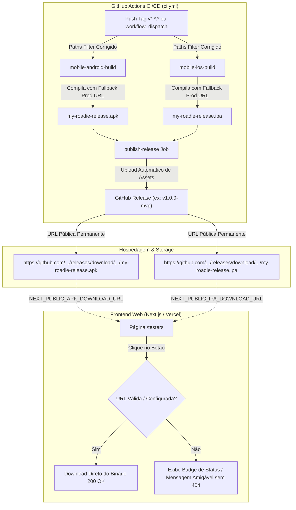

# Plano de Implementação — 018: Hospedagem e Distribuição de Executáveis de Release do MVP

## 1. Visão Geral da Arquitetura de Distribuição & Pipeline Saneado



---

## 2. Fases de Execução

### Fase 0: Diagnóstico, Mapeamento e Auditoria da Spec 017
- Mapear o comportamento atual de [`frontend-web/src/app/testers/page.tsx`](file:///C:/dev/my-roadie-platform/frontend-web/src/app/testers/page.tsx) com e sem as variáveis de ambiente `NEXT_PUBLIC_APK_DOWNLOAD_URL` e `NEXT_PUBLIC_IPA_DOWNLOAD_URL`.
- Registrar na seção "Resultados da Inspeção" do `spec.md` as falhas identificadas no workflow `ci.yml` da Spec 017 (`paths-filter` com diff vazio em push para `main`, fallback de `BACKEND_URL` ausente e assimetria de nomenclatura).

### Fase 1: Padronização de Releases, Correções no CI/CD e URLs
- **Correção no `ci.yml`**:
  - Ajustar `dorny/paths-filter@v3` para usar `base: ${{ github.base_ref }}` (evitando que `base: main` force comparação vazia no push para a `main`).
  - Injetar fallback de produção no `BACKEND_URL`: `--dart-define=BACKEND_URL=${{ inputs.backend_url || secrets.BACKEND_URL || 'https://my-roadie-backend.onrender.com' }}` nos jobs `mobile-android-build` e `mobile-ios-build`.
  - Renomear o artefato compilado Android de `app-release.apk` para `my-roadie-release.apk`.
- **Padronização de URLs**:
  - Formato por tag: `https://github.com/<owner>/<repo>/releases/download/<tag>/my-roadie-release.apk`
  - Formato latest: `https://github.com/<owner>/<repo>/releases/latest/download/my-roadie-release.apk`
  - Atualizar [`frontend-web/public/downloads/README.md`](file:///C:/dev/my-roadie-platform/frontend-web/public/downloads/README.md).

### Fase 2: Resiliência e UI da Página de Testadores (`/testers`)
- Atualizar [`frontend-web/src/app/testers/page.tsx`](file:///C:/dev/my-roadie-platform/frontend-web/src/app/testers/page.tsx):
  - Detectar se `NEXT_PUBLIC_APK_DOWNLOAD_URL` e `NEXT_PUBLIC_IPA_DOWNLOAD_URL` estão configuradas com URLs válidas (`http://`, `https://` ou asset real).
  - Se a URL for um link externo válido ou apontar para um release real, renderizar o botão de download com link direto.
  - Se a URL estiver ausente ou não configurada no ambiente atual, desabilitar o clique cego (evitando 404) e exibir uma mensagem amigável (ex.: "Release em preparação para este ambiente").
  - Incluir informações de versão ativa (lida de `process.env.NEXT_PUBLIC_APP_VERSION || 'MVP 1.0.0'`).

### Fase 3: Automação de Publicação de Release no CI/CD (`.github/workflows/ci.yml`)
- Adicionar evento de gatilho para tags de versão:
  ```yaml
  on:
    push:
      tags:
        - 'v*'
  ```
- Criar o job `publish-github-release`:
  - Depende de: `[mobile-android-build, mobile-ios-build]`
  - Condição: `github.ref_type == 'tag'` ou input de release via `workflow_dispatch`.
  - Coleta os artefatos de release gerados (`my-roadie-release.apk` e `my-roadie-release.ipa`).
  - Utiliza `softprops/action-gh-release@v2` com permissão `contents: write` para publicar e anexar os binários como assets públicos para download direto.

### Fase 4: Testes Unitários e Testes E2E (Playwright)
- Criar/atualizar testes unitários em `frontend-web/src/app/testers/page.test.tsx` (Vitest) para validar:
  - Renderização correta dos botões de download com URLs customizadas via `NEXT_PUBLIC_APK_DOWNLOAD_URL`.
  - Tratamento de fallback e desativação segura sem quebrar a UI quando variáveis não estiverem definidas.
- Adicionar teste E2E no Playwright (`frontend-web/tests/testers.spec.ts`) validando a rota `/testers`, visibilidade das instruções e integridade dos links de download.

### Fase 5: Documentação Operacional e Sincronização
- Criar o arquivo `docs/operations/release-runbook.md` com:
  - Como gerar e taggear uma nova versão (`git tag v1.0.0 && git push origin v1.0.0`).
  - Como configurar as variáveis na Vercel e no `.env.local`.
  - Como testar o download antes de enviar aos testers.
- Atualizar `backlog.md` registrando a Spec 018 e alinhando as futuras specs de E2E mobile.

---

## 3. Conformidade com a Constituição (`constitution.md`)

- **§1 Stack**: Utiliza Next.js App Router, GitHub Actions nativo e TypeScript sem introduzir dependências desnecessárias.
- **§9 Segurança**: Nenhuma chave privada ou segredo é exposto; apenas links públicos de artefatos compilados para distribuição aos testers.
- **§10 Governança**: Documentação centralizada e rastreável através de specs e runbook de operações.
