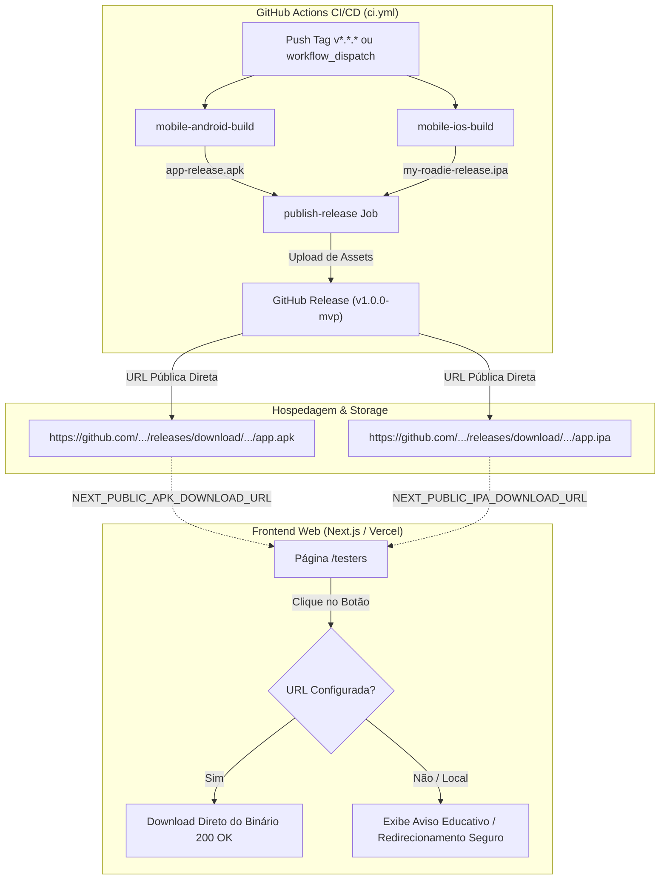

# Plano de Implementação — 018: Hospedagem e Distribuição de Executáveis de Release do MVP

## 1. Visão Geral da Arquitetura de Distribuição



---

## 2. Fases de Execução

### Fase 0: Diagnóstico, Mapeamento e Validação da Base
- Mapear o comportamento atual de [`frontend-web/src/app/testers/page.tsx`](file:///C:/dev/my-roadie-platform/frontend-web/src/app/testers/page.tsx) com e sem as variáveis de ambiente `NEXT_PUBLIC_APK_DOWNLOAD_URL` e `NEXT_PUBLIC_IPA_DOWNLOAD_URL`.
- Registrar no `spec.md` da Spec 018 a análise detalhada das rotas e verificar as suítes de teste existentes em `frontend-web/tests/`.

### Fase 1: Armazenamento e Geração de Releases (GitHub Releases / Supabase)
- Padronizar os nomes finais dos binários: `my-roadie-release.apk` (Android) e `my-roadie-release.ipa` (iOS).
- Estruturar o formato canônico das URLs públicas de download para apontar para GitHub Releases:
  - Formato por tag: `https://github.com/<owner>/<repo>/releases/download/<tag>/my-roadie-release.apk`
  - Formato latest: `https://github.com/<owner>/<repo>/releases/latest/download/my-roadie-release.apk`
- Fornecer documentação de fallback caso seja utilizado bucket público do Supabase Storage.

### Fase 2: Resiliência e UI da Página de Testadores (`/testers`)
- Atualizar [`frontend-web/src/app/testers/page.tsx`](file:///C:/dev/my-roadie-platform/frontend-web/src/app/testers/page.tsx):
  - Detectar se `NEXT_PUBLIC_APK_DOWNLOAD_URL` e `NEXT_PUBLIC_IPA_DOWNLOAD_URL` estão configuradas ou se apontam para o fallback local inexistente.
  - Se a URL for um link externo válido ou apontar para um release real, renderizar o botão de download com link direto `target="_blank"` ou download nativo.
  - Se a URL estiver ausente ou não configurada no ambiente atual, desabilitar o clique cego (evitando 404) e exibir uma mensagem amigável (ex.: "Release em preparação para este ambiente" ou direcionar para a área de releases).
  - Incluir informações de versão ativa (lida de `process.env.NEXT_PUBLIC_APP_VERSION || 'MVP 1.0.0'`) e data do build.

### Fase 3: Automação de Publicação de Release no CI/CD (`.github/workflows/ci.yml`)
- Adicionar evento de gatilho para tags de versão:
  ```yaml
  on:
    push:
      tags:
        - 'v*'
  ```
- Criar o job `publish-github-release`:
  - Depende de: `[mobile-android-build, mobile-ios-build]`
  - Condição: `github.ref_type == 'tag'` ou input de release via `workflow_dispatch`.
  - Coleta os artefatos de release gerados (`mobile/build/app/outputs/flutter-apk/app-release.apk` e `mobile/my-roadie-release.ipa`).
  - Utiliza `softprops/action-gh-release@v2` para criar/atualizar a release e anexar os binários como assets públicos para download direto.

### Fase 4: Testes Unitários e Testes E2E (Playwright)
- Criar/atualizar testes unitários em `frontend-web/src/app/testers/page.test.tsx` (Vitest) para validar:
  - Renderização correta dos botões de download com URLs customizadas via `NEXT_PUBLIC_APK_DOWNLOAD_URL`.
  - Tratamento de fallback e desativação segura sem quebrar a UI quando variáveis não estiverem definidas.
- Adicionar teste E2E no Playwright (`frontend-web/tests/testers.spec.ts`) validando a rota `/testers`, visibilidade das instruções e integridade dos links de download.

### Fase 5: Documentação Operacional e Sincronização
- Criar o arquivo `docs/operations/release-runbook.md` com:
  - Como gerar e taggear uma nova versão (`git tag v1.0.0 && git push origin v1.0.0`).
  - Como configurar as variáveis na Vercel e no `.env.local`.
  - Como testar o download antes de enviar aos testers.
- Atualizar `backlog.md` registrando a Spec 018 e alinhando as futuras specs de E2E mobile.

---

## 3. Conformidade com a Constituição (`constitution.md`)

- **§1 Stack**: Utiliza Next.js App Router, GitHub Actions nativo e TypeScript sem introduzir dependências desnecessárias.
- **§9 Segurança**: Nenhuma chave privada ou segredo é exposto; apenas links públicos de artefatos compilados para distribuição pública/fechada.
- **§10 Governança**: Documentação centralizada e rastreável através de specs e runbook de operações.
