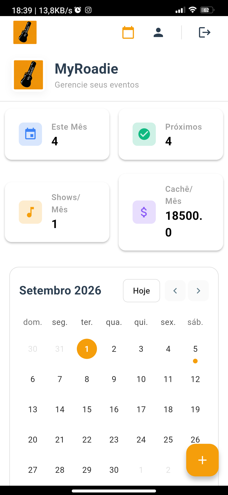
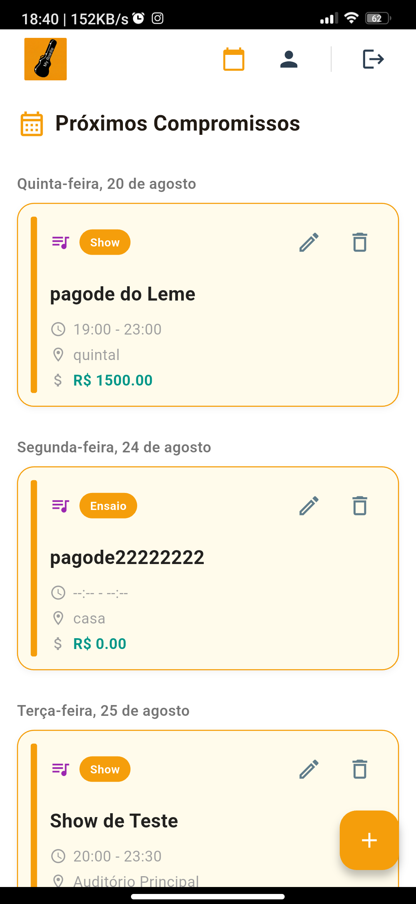
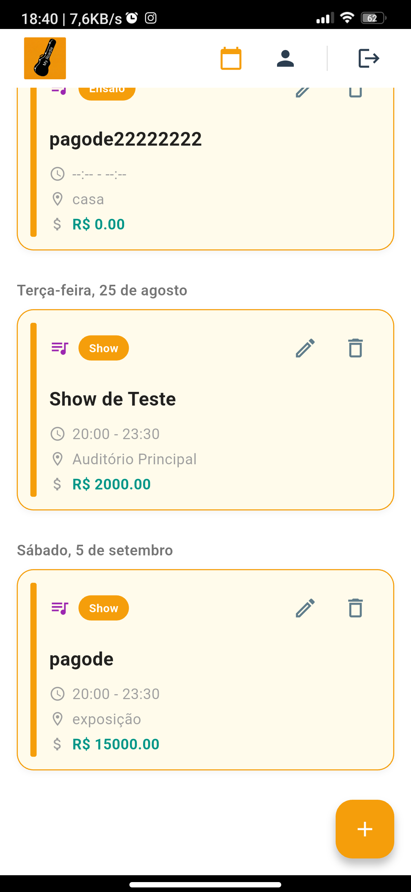
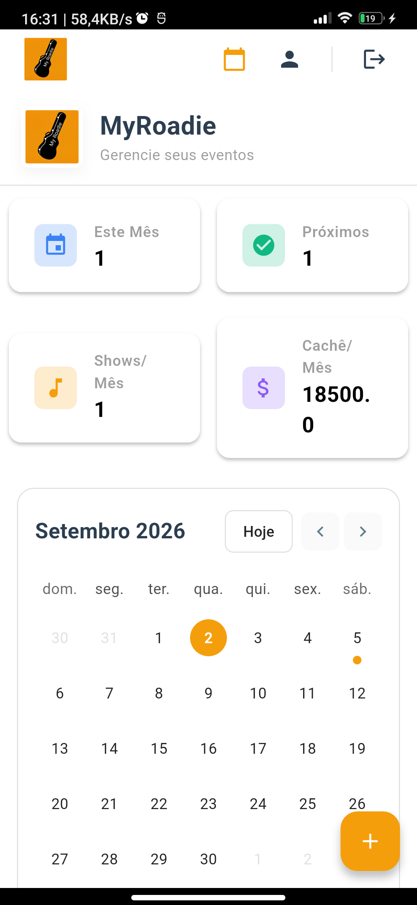
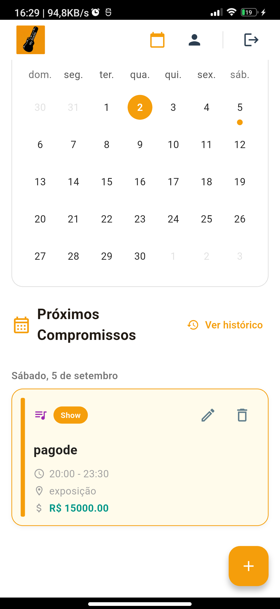
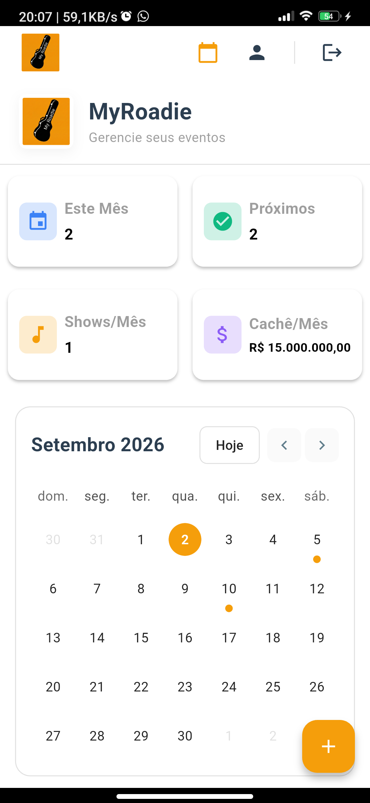

# Spec — 022: Correção dos Cards de Estatísticas do Dashboard (Mobile)

## Objetivo

Corrigir os cálculos e a formatação visual dos cards de resumo exibidos no topo da tela principal ([`PrincipalScreen`](file:///C:/dev/my-roadie-platform/mobile/lib/presentation/screens/principal/principal_screen.dart) / [`InfosWidget`](file:///C:/dev/my-roadie-platform/mobile/lib/presentation/screens/principal/widgets/infos_widget.dart)), garantindo que:
1. O card **"Este Mês"** reflita a quantidade de compromissos do mês corrente.
2. O card **"Shows/Mês"** contabilize exclusivamente eventos do tipo `"Show"` que ocorram no mês corrente (ignorando ensaios e reuniões).
3. O card **"Cachê/Mês"** totalize exclusivamente os cachês de eventos do mês corrente (não acumulando meses futuros).
4. O valor do faturamento seja formatado no padrão monetário brasileiro (`R$ X.XXX,XX`), com ajuste responsivo para não quebrar feio em duas linhas nem sofrer overflow no card.

## Por quê

- **Primeira impressão e confiabilidade**: Ao abrir a Agenda, o bloco de métricas no topo é o primeiro elemento visual de destaque do dashboard. Dados errados ou formatados de forma bruta passam sensação de app inacabado.
- **Diagnóstico das causas-raiz**:
  1. **`compromissosTotal` (card "Este Mês")**: Em [`PrincipalScreen`](file:///C:/dev/my-roadie-platform/mobile/lib/presentation/screens/principal/principal_screen.dart#L89), recebia `events.length` e posteriormente `upcomingEvents.length`. Porém, o título do card é "Este Mês", gerando confusão caso haja eventos em meses futuros distantes.
  2. **`totalFee` (card "Cachê/Mês")**: Em [`AgendaController.totalFee`](file:///C:/dev/my-roadie-platform/mobile/lib/presentation/controllers/agenda_controller.dart#L66), a soma é feita sobre todo o `state` via `fold`, somando cachês de compromissos de meses futuros no card que diz "Cachê/Mês".
  3. **`monthlyShows` (card "Shows/Mês")**: Em [`AgendaController.monthlyShows`](file:///C:/dev/my-roadie-platform/mobile/lib/presentation/controllers/agenda_controller.dart#L68-L73), filtra por `month` e `year`, mas calcula o tamanho da lista total sem checar `type == 'Show'`. Se a banda tiver 3 ensaios e 1 show no mês, exibe "4 Shows/Mês".
  4. **Formatação monetária**: Em [`InfosWidget.infoCard`](file:///C:/dev/my-roadie-platform/mobile/lib/presentation/screens/principal/widgets/infos_widget.dart#L52), o valor é interpolado com `faturamento.toString()` puro (ex.: `"18500.0"`), sem símbolo monetário `R$`, sem pontuação de milhar e com tamanho de fonte que quebra desordenadamente dentro dos 180px de largura do card.

## Evidências dos Bugs (Screenshots)

As capturas abaixo foram obtidas em dispositivo físico/ambiente de execução real (01/09/2026) e documentam visualmente as causas-raiz:

### 1. Dashboard com contagem incorreta e quebra de layout no Cachê

- **Card "Este Mês":** exibe `4`, mas em setembro de 2026 existe apenas **1** evento cadastrado (05/09). Os outros 3 ocorreram em agosto (20/08, 24/08 e 25/08).
- **Card "Próximos":** exibe `4`, idêntico ao card "Este Mês".
- **Card "Cachê/Mês":** exibe `18500.` na linha superior e `0` na inferior (valor cru sem formatação `R$` e quebrando a linha desordenadamente). Além disso, o valor totaliza a soma de todos os eventos da base (`1.500 + 2.000 + 15.000 = 18.500`), acumulando o cachê de agosto no card que diz "Cachê/Mês" de setembro.

### 2. Compromissos cadastrados na base (Agosto e Setembro)

- **20 de agosto (Agosto):** Show `pagode do Leme` — Cachê: `R$ 1500.00`
- **24 de agosto (Agosto):** Ensaio `pagode22222222` — Cachê: `R$ 0.00`
- **25 de agosto (Agosto):** Show `Show de Teste` — Cachê: `R$ 2000.00`
- **05 de setembro (Setembro):** Show `pagode` — Cachê: `R$ 15000.00` *(único evento de setembro)*

A soma dos três cachês (`1.500 + 2.000 + 15.000 = 18.500,00`) comprova que o card de cachê somava indiscriminadamente eventos passados de outros meses.

### 3. Linha de base visual pós-spec 021 (Capturada em 02/09/2026 via ADB)

- **Cards no topo (`flutter_04.png`):** O card "Este Mês" e "Próximos" exibem `1` (pois a lista exibe apenas o evento de 05/09). O card "Cachê/Mês" continua exibindo o valor bruto `18500.` na linha de cima e `0` na linha de baixo (quebra inadequada sem símbolo monetário `R$`), acumulando incorretamente os cachês de agosto no mês de setembro.
- **Lista de compromissos (`flutter_05.png`):** Exibe com sucesso o botão "Ver histórico" e o único evento futuro de setembro (`R$ 15000.00`), comprovando que os eventos passados já foram movidos para o histórico na spec 021.

### 4. Resultado Final Aprovado (Pós-Spec 022 — Capturada em 02/09/2026 via ADB)

- **Cards perfeitamente simétricos:** Todos os 4 cards possuem dimensões rigorosamente idênticas (`180px × 96px`), respeitando o sistema de grid de 4/8pt.
- **Tipografia padronizada em negrito:** Título e valor em `16px bold`, garantindo alta legibilidade e sem quebras defeituosas.
- **Isolamento e Formatação:** O card "Cachê/Mês" exibe o valor formatado no padrão brasileiro (testado até `R$ 15.000.000,00`), perfeitamente contido em uma única linha e sem overflow graças ao `FittedBox`.
- **Contagem rigorosa:** O card "Este Mês" contabiliza todos os compromissos de setembro (2 eventos: show + ensaio), enquanto "Shows/Mês" contabiliza estritamente os eventos de tipo Show (1 show).

## Escopo

- **`AgendaController` (`mobile/lib/presentation/controllers/agenda_controller.dart`)**:
  - `monthlyEvents`: getter retornando todos os eventos cuja data pertença ao mês e ano correntes.
  - `monthlyShows`: ajustar para contar apenas eventos de `monthlyEvents` onde `type.toLowerCase() == 'show'`.
  - `monthlyFee`: getter somando o `fee` de todos os eventos de `monthlyEvents`.
  - Manter compatibilidade com `upcomingEvents` e `pastEvents` criados na spec 021.
- **`InfosWidget` (`mobile/lib/presentation/screens/principal/widgets/infos_widget.dart`)**:
  - Formatar o valor monetário utilizando `NumberFormat.currency(locale: 'pt_BR', symbol: 'R$')` da biblioteca `intl`.
  - Aplicar ajuste no `infoCard` (ex.: `FittedBox` ou tamanho de fonte ajustado) para acomodar valores de cachê mais altos sem truncamento ou overflow visual.
- **`PrincipalScreen` (`mobile/lib/presentation/screens/principal/principal_screen.dart`)**:
  - Conectar os novos getters no `InfosWidget`:
    - `compromissosTotal`: eventos do mês corrente (`monthlyEvents.length`).
    - `proximos`: eventos futuros a partir de hoje (`upcomingEvents.length`), mantendo paridade com a lista "Próximos Compromissos".
    - `shows`: `monthlyShows`.
    - `faturamento`: `monthlyFee`.

### Decisões tomadas na Fase 0

- **T0.1 — Comportamento dos cards "Este Mês" e "Próximos":** Confirmado que o card **"Este Mês"** exibe todos os compromissos do mês corrente (passados + futuros deste mês). O card **"Próximos"** exibe todos os compromissos a partir de hoje (`upcomingEvents.length`), sincronizado com a lista de próximos compromissos da tela. O `InfosWidget` passará a receber esse valor diretamente, eliminando o cálculo legado `compromissosTotal - compromissosConcluidos`.
- **T0.2 — Diagnóstico da quebra de layout e estratégia com `FittedBox`:**
  - *Ponto de quebra:* O `infoCard` possui largura fixa de 180px (`Container`). Dentro dele, o `ListTile` aloca cerca de 40px para o ícone `leading` mais paddings e gaps internos do Material, restando entre 70px e 80px úteis para o `subtitle`. Com `fontSize: 20` em negrito, valores com mais de 6 caracteres (como `"18500.0"` ou o valor formatado `"R$ 15.000,00"`) não cabem na linha e sofrem quebra indesejada.
  - *Estratégia definida:* Envolver o `Text` do `subtitle` em um `FittedBox` com `fit: BoxFit.scaleDown` e `alignment: Alignment.centerLeft`, configurando o `Text` com `maxLines: 1`. Isso força o texto a permanecer em linha única e sofrer redução de escala proporcional e elegante apenas se o número exceder a largura disponível.
- **T0.3 — Formatação de cachê zerado:** Confirmado que quando o faturamento for zero (`0.0`), o card "Cachê/Mês" exibirá formalmente `R$ 0,00`, através de `NumberFormat.currency(locale: 'pt_BR', symbol: 'R$')`, mantendo consistência monetária.
- **T0.4 — Mapeamento de regressões na suíte de testes:**
  - Suíte completa executada via `flutter test` (122 testes passando com sucesso).
  - Em `test/infos_widget_test.dart`: identificada expectativa literal pela string bruta `'2500.0'`, que falhará propositalmente quando a máscara `R$` for implementada (previsto para atualização controlada na task T2.3), além da adaptação do parâmetro `proximos`.
  - Em `test/agenda_controller_test.dart`: o teste de `totalFee` continuará passando ao preservar o getter legado para retrocompatibilidade; os novos testes de `monthlyFee` e restrição de tipos de `monthlyShows` serão adicionados isoladamente em T1.2.
  - Em `test/principal_screen_test.dart`: nenhum dos 4 testes existentes verifica os textos dos cards de resumo do `InfosWidget`, assegurando que não haverá efeitos colaterais na tela principal.
- **T0.5 — Linha de base visual pós-spec 021:** Capturadas e anexadas novas screenshots em dispositivo físico via ADB (`flutter_04.png` e `flutter_05.png`), registrando a persistência do valor bruto/quebra no card de cachê (`18500.` / `0`) e a presença do botão "Ver histórico" e filtro de compromissos introduzidos na spec 021.
- **Testes (`mobile/test/`)**:
  - Testes unitários no `AgendaController` para `monthlyEvents`, `monthlyShows` (com e sem eventos que não sejam show) e `monthlyFee` (isolando eventos deste mês de meses futuros).
  - Testes de widget em `infos_widget_test.dart` validando formatação monetária e renderização.
  - Atualização dos testes de widget em `principal_screen_test.dart`.

## Fora de escopo

- Alterações no backend (`/events`), banco de dados ou Prisma schema (todos os dados necessários já são retornados pela API).
- Redesenho completo do componente `InfosWidget` (mantém o design em grid de 4 cards existente).
- Filtros por intervalo arbitrário de datas ou navegação para meses anteriores/posteriores no dashboard (evolução futura).

## Critérios de Sucesso

- [x] Card "Este Mês" exibe a quantidade exata de compromissos pertencentes ao mês e ano atuais.
- [x] Card "Shows/Mês" exibe a quantidade de eventos do mês atual com tipo igual a "Show" (case-insensitive).
- [x] Card "Cachê/Mês" totaliza apenas cachês de eventos do mês atual e não inclui meses futuros.
- [x] O valor do cachê é exibido formatado em moeda brasileira (ex.: `R$ 1.500,00` ou `R$ 0,00`).
- [x] Valores de cachê altos cabem no card sem estourar a tela (overflow) ou quebrar de forma defeituosa.
- [x] Suíte de testes unitários e de widget cobrindo os novos cenários passando em 100% com `flutter test`.
- [x] `backlog.md` atualizado com o encerramento da spec na Release `v1.1.0`.
